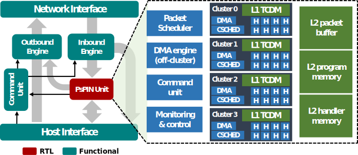

# PsPIN: A RISC-V in-network accelerator for flexible high-performance low-power packet processing

PsPIN [1] is an implementation of the sPIN programming model[2] based on PULP [3]. This repository includes the RTL code implementing PsPIN, the runtime software, and a set of examples to get started. 

The repositority has the following structure:

 - hw/ 
   - hw/deps: (RTL) Dependencies from the PULP platform (https://github.com/pulp-platform). Some of them have been adapted to fit in the PsPIN design. **License:** SolderPad 0.51.
   - hw/src: (RTL) PsPIN components. **License:** SolderPad 0.51.
   - hw/verilator_model: (functional) Components implementing the NIC model shown by the above figure. **License:** Apache 2.0.
 - sw/ 
   - sw/pulp-sdk: Dependencies from the PULP SDK adapted to fit the PsPIN design. **License:** Apache 2.0.
   - sw/rules: Makefile rules used to ease simulutions setups and runs. **License:** Apache 2.0.
   - sw/runtime: HPUs main loop and support functions for the handlers. **License:** Apache 2.0.
   - sw/script: utilities for extracting data from the simulation output. **License:** Apache 2.0.

## References

[1] Di Girolamo Salvatore, Kurth Andreas, Calotoiu Alexandru, Benz Thomas, Schneider Timo, Beranek Jakub, Benini Luca, Hoefler Torsten. "A RISC-V in-network accelerator for flexible high-performance low-power packet processing." 2021 ACM/IEEE 48th Annual International Symposium on Computer Architecture (ISCA). IEEE, 2021. 

[2] Hoefler Torsten, Salvatore Di Girolamo, Konstantin Taranov, Ryan E. Grant, and Ron Brightwell. "sPIN: High-performance streaming Processing in the Network." In Proceedings of the International Conference for High Performance Computing, Networking, Storage and Analysis, pp. 1-16. 2017.

[3] Rossi, Davide, Francesco Conti, Andrea Marongiu, Antonio Pullini, Igor Loi, Michael Gautschi, Giuseppe Tagliavini, Alessandro Capotondi, Philippe Flatresse, and Luca Benini. "PULP: A parallel ultra low power platform for next generation IoT applications." In 2015 IEEE Hot Chips 27 Symposium (HCS), pp. 1-39. IEEE, 2015.
