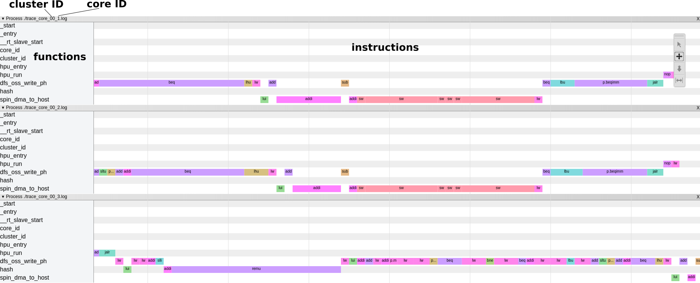

# PsPIN: A RISC-V in-network accelerator for flexible high-performance low-power packet processing

<div align="center"></div>


PsPIN [1] is an implementation of the sPIN programming model [2] based on PULP [3]. This repository includes the RTL code implementing PsPIN, the runtime software, and a set of examples to get started. We provide a toolchain that allows to define, build, and test new handlers through cycle-accurate simulations. 

**Workflow summary:** The RTL code is verilated into C++ modules that are compiled together with the functional models into two libraries: `libpspin.so` and `libpspin_debug.so`. To write your own handler, you need to define the handler code and a simulation driver. The handler code must be compiled with RISC-V GCC (link here). The simulation driver interfaces to `libpspin.so` for (1) initializing the simulation; (2) defining the content of L2 handler memory; (3) defining the handlers to offload; (4) defining and injecting packets to process; (5) handle events generated by the execution of the handlers (e.g., packets being sent or writes/reads to/from host memory). By linking against `libpspin_debug.so` you make the simulation a `waves.vcd` that can be explored with any value-change-dump editor (e.g., GTKWave http://gtkwave.sourceforge.net/).

**Repo organization:** The repositority has the following structure:

 - `hw/`: Hardware components and simulation logic.
   - `hw/deps/`: (RTL) Dependencies from the PULP platform (https://github.com/pulp-platform). Some of them have been adapted to fit in the PsPIN design. **License:** SolderPad 0.51.
   - `hw/src/`: (RTL) PsPIN components. **License:** SolderPad 0.51.
   - `hw/verilator_model/`: (functional) Components implementing the NIC model shown by the above figure. **License:** Apache 2.0.
 - `sw/`: Software components. **License:** Apache 2.0.
   - `sw/pulp-sdk/`: Dependencies from the PULP SDK adapted to fit the PsPIN design. 
   - `sw/rules/`: Makefile rules used to ease simulutions setups and runs. 
   - `sw/runtime/`: HPUs runtime code and support functions for the handlers. 
   - `sw/script/`: utilities for extracting data from the simulation output. 
 - `examples/`: Examples of sPIN handlers. **License:** Apache 2.0.
    - `examples/*/driver/`. Simulation driver.
    - `examples/*/handlers/`. Handlers code.

## Dependencies
 - Verilator >= v4.108 (https://www.veripool.org/wiki/verilator)
 - RISC-V GCC toolchain (source: https://github.com/pulp-platform/pulp-riscv-gnu-toolchain; prebuilt: [Ubuntu-x86-64](http://spclstorage.inf.ethz.ch/~digirols/pspin/riscv-gcc-ubuntu.tar.gz))

## Getting started
Here is a walkthrough to setup the simulation and run example handlers. 

### 1. Setting up the environment 
 Copy the `sourceme-template.sh` file to `sourceme.sh` and update the following variables:
 
 ```bash
export RISCV_GCC=<path to the RISC-V GCC toolchain binaries, e.g., /home/salvo/riscv-gcc/bin/>
export PSPIN_HW=<path to the hw, e.g., /home/salvo/pspin/hw/>
export PSPIN_RT=<path to the sw, e.g., /home/salvo/pspin/sw/>
```

**Source this file every time you want to run simulations!**
```bash 
source sourceme.sh
```

### 2. Verilating the hardware

Verilating the hardware is needed whenever you want test new hardware changes that are not available in the relased packeges. The verilation process can take quite long time (20-30 minutes on a Xeon X7550) and can require up to 16 GB of memory. Consider to use the prebuilt libraries if they fit your use case. 

```bash
cd hw/verilator_model/

# Compile `libpspin.so`
make release

# (Optional) Compile `libpspin_debug.so`
make debug
```

### 3. Compile handlers and simulation driver and run! 
Here we show how to compile&run the `ping-pong` example. Same instructions apply for other examples too. 

```bash
cd examples/ping_pong
make all
```

This prouduces two executable: `sim_pingpong` (linked against `libpspin.so`) and `sim_pingpong_debug` (linked against `libpspin_debug.so`). Type `./sim_pingpong --help` to see the possible command-line arguments or just run `./sim_pingpong` to run with the default arguments.


### 4. Check data

The simulation produces a summary at the end that looks like this:
```
###### Statistics ######
NIC inbound engine:
	Packets: 32; Bytes: 32768
	Avg packet length: 1024.000 B
	Feedback throughput: 443.197 Gbit/s (feedback arrival time: 18.484 ns)
	Packet latency: avg: 119.750 ns; min: 108 ns; max: 155 ns
	HER stalls: 0
----------------------------------
NIC outbound engine:
	Commands: 32; Packets: 32; Bytes: 32768
	Avg packet length: 1024.000 B
	Packet throughput: 443.197 Gbit/s (pkt departure time: 18.484 ns)
----------------------------------
PCIe Slave:
	Writes: beats: 0; bytes: 0; avg throughput: -nan Gbit/s
	Reads: beats: 0; bytes: 0; avg throughput: -nan Gbit/s
----------------------------------
PCIe Master:
	Bytes written: 0; Bytes read: 0
----------------------------------
```

It reports information for each of the functional modules (i.e., NIC inbound and outbound engines, PCIe). 

To gain more insights, you can type: `make info` to produce information about the executed handlers:
```
#[key] handler cluster_id core_id start_time end_time latency instructions loads stores bsws branches l2_accesses local_l1_accesses remote_l1_accesses other_accesses
 pingpong_ph 00 0 1225000 1312000 87000 29 9 10 0 0 0 11 0 8
 pingpong_ph 00 0 1325000 1363000 38000 29 9 10 0 0 0 11 0 8
 pingpong_ph 00 0 1385000 1423000 38000 29 9 10 0 0 0 11 0 8
 pingpong_ph 00 0 1445000 1483000 38000 29 9 10 0 0 0 11 0 8
...
```
In particular, it shows for each executed handler, the cluster and core where it has been executed, the starting and ending times (in picoseconds), the duration (in picoseconds), total number of instructions, and number of instructions per instruction class.

We also provide a tool for quick&raw data visualization: `make stats` (note: needs gnuplot installed). It works only if you redirected the simulation stdout to a `transcript` file (e.g., `./sim_pingpong > transcript`).

**Debugging:** in order to debug the handlers, you can produce a trace of all executed instructions with `make trace`. The output reports one instruction per line:
```
1845000 1841 1000 00 1 pingpong_ph 1d0003b2 ping_pong.c:38 lhu "lhu  x12, 2(x14)         x12=00000400 x14:1000bc00  PA:1000bc02"
```
It reports the following information:
 - time at which the instruction completed (picoseconds): `1845000`
 - time at which the instruction completed (cycles): `1845`
 - duration (picoseconds): `1000`
 - cluster ID from where the instruction originated: `00`
 - core ID (relative to the cluster) from where the instruction originated: `1`
 - function name: `pingpong_ph`
 - program counter: `1d0003b2`
 - file:line: `ping_pong.c:38`
 - instruction mnemonic: `lhu`
 - full instruction with actual register values: `lhu  x12, 2(x14)         x12=00000400 x14:1000bc00  PA:1000bc02`

Alternatively, you produce JSON trace with `make trace-chrome` and visualize them with your browser (type `about://tracing` in the address bar and load the JSON file). Works on Google Chrome, Chromimum, and Firefox. 

<div align="center"></div>


Note: the tracing tool is available at https://github.com/SalvatoreDiGirolamo/tracevis and can be used to produce enriched traces from RI5CY traces.

## Citation

Please include this citation if you use this work as part of your project:

```
@inproceedings{pspin,
	title={A RISC-V in-network accelerator for flexible high-performance low-power packet processing},
	author={Di Girolamo, Salvatore and Kurth, Andreas and Calotoiu, Alexandru and Benz, Thomas and Schneider, Timo and Beranek, Jakub and Benini, Luca and Hoefler, Torsten},
	booktitle={2021 ACM/IEEE 48th Annual International Symposium on Computer Architecture (ISCA)},
	year={2021}
}
```

## References

[1] Di Girolamo Salvatore, Kurth Andreas, Calotoiu Alexandru, Benz Thomas, Schneider Timo, Beranek Jakub, Benini Luca, Hoefler Torsten. "A RISC-V in-network accelerator for flexible high-performance low-power packet processing." 2021 ACM/IEEE 48th Annual International Symposium on Computer Architecture (ISCA). IEEE, 2021. 

[2] Hoefler Torsten, Salvatore Di Girolamo, Konstantin Taranov, Ryan E. Grant, and Ron Brightwell. "sPIN: High-performance streaming Processing in the Network." In Proceedings of the International Conference for High Performance Computing, Networking, Storage and Analysis, pp. 1-16. 2017.

[3] Rossi, Davide, Francesco Conti, Andrea Marongiu, Antonio Pullini, Igor Loi, Michael Gautschi, Giuseppe Tagliavini, Alessandro Capotondi, Philippe Flatresse, and Luca Benini. "PULP: A parallel ultra low power platform for next generation IoT applications." In 2015 IEEE Hot Chips 27 Symposium (HCS), pp. 1-39. IEEE, 2015.
